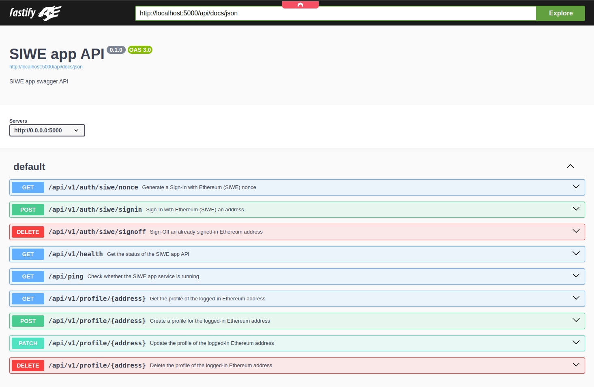

# SIWE App Demo

## Summary

### Backend

Implemente a web server in TypeScript that provides a RESTful API and stores data in a SQL database. These are the technologies used:

- Web server: [Fastify](https://fastify.dev/).
- Database: [PostgreSQL 15](https://www.postgresql.org/) (relational DB).
- ORM: [Prisma](https://www.prisma.io/).
- Web3 JavaScript libraries for EVMs: [ethers.js](https://docs.ethers.org/v5/).
- Authentication method: [Sign-In With Ethereum (SIWE)](https://login.xyz/).
- Containerisation: [Docker](https://docs.docker.com/build/) and [Docker Compose](https://docs.docker.com/compose/).

### Frontend

NA.

## Design

### User Cases

The user cases help to define the RESTful API and the front-end. As a user I can:

- Sign-in with an EVM account.
  - Requirements:
    - To not be signed-in.
    - Use SIWE in a secure way.
    - Persist the authentication for a while in the browser session.
  - Expected UX:
    - Profile exists:
      - Automatically see the profile.
      - Edit the profile.
      - Delete the profile.
    - Profile does not exist:
      - Create a profile.
    - Sign-off.
- Sign-off it.
  - Requirements:
    - To be signed-in.
  - Expected UX:
    - Profile exists:
      - Profile data disappears.
- Create a profile for the EVM account (`name` and `bio`):
  - Requirements:
    - To be signed-in.
    - Profile does not exist.
    - Profiles that previously existed can be created again.
    - Property `name` is required, `bio` is optional.
  - Expected UX:
    - One input per field.
    - Clear and visible error messages upon unsuccessful creation.
    - Back to the sing-in UI upon successful creation.
- Edit the profile:
  - Requirements:
    - To be signed-in.
    - Profile exists.
    - Any of `name` or `bio` (or both) can be edited.
  - Expected UX:
    - One input per field.
    - Clear and visible error messages upon unsuccessful creation.
    - Back to the sing-in UI upon successful creation.
- Delete the profile:
  - Requirements:
    - To be signed-in.
    - Profile exists.
    - Hard delete.
  - Expected UX:
    - 2-step process (double confirmation).
    - Profile data disappears. Back to sing-in UI without profile.
- Get the profile:
  - Requirements:
    - To be signed-in.
    - Profile exists.
  - Expected UX:
    - Ethereum address format is checksum

Other considerations as a user:

- I can't sign-in with an address I can't sign a message with.
- I can't CRUD other profiles that are not the one from the address signed in.

### Backend Implementation

#### Project structure overview

- `backend/prisma/`: contains the database schema and migration files.
- `backend/src/controllers/`: the functions that handle the HTTP requests. Each function is tied to a specific route and interacts with services to process the request and send back a response.
- `backend/src/middlewares/`: contains functions to be used by the routes to process (e.g. validations) and modify the incoming request data before it is passed on to the corresponding controller.
- `backend/src/queries/`: contains DB-related functions and utilities that help building queries by the services.
- `backend/src/routes/`: defines the RESTful API endpoints. Each route maps to a controller function that handles the respective HTTP request.
- `backend/src/schemas/`: contains JSON schema files that define the shape of the requests and responses data. It helps validating the data received from the clients and ensuring type safety.
- `backend/src/serializers/`: contains the functions that transform the data (e.g. from DB queries) to be returned in the response as JSON.
- `backend/src/services/`: contains the business logic of the RESTFul API. It encapsulates core functionality and interacts with the DB through the Prisma client.
- `backend/src/server.ts`: the entry point for the app. It sets up the Fastify server by registering routes, middleware, plug-ins, etc. and it finally starts the server.
- `backend/docker-compose.yaml`: Docker Compose file for both the PostgreSQL and the Fastify server.
- `backend/Dockerfile`: Docker file for the Fastify server.

#### Database schema overview

```sql
-- CreateTable
CREATE TABLE "profile" (
    "id" TEXT NOT NULL,
    "address" TEXT NOT NULL,
    "name" VARCHAR(50) NOT NULL,
    "bio" TEXT,
    "created_at" TIMESTAMP(3) NOT NULL DEFAULT CURRENT_TIMESTAMP,
    "updated_at" TIMESTAMP(3) NOT NULL,

    CONSTRAINT "profile_pkey" PRIMARY KEY ("id")
);

-- CreateIndex
CREATE UNIQUE INDEX "profile_address_key" ON "profile"("address");
```

- Not a single `Profile` field is tied to an EVM address format. For instance, it could very well store profiles for Bitcoin or Substrate addresses.
- `Profile.id` is of type [Cuid2](https://github.com/paralleldrive/cuid2).
- `Profile.address` is not nullable, unique and it has been indexed.
- `Profile.name` is not nullable.
- `Profile.bio` is nullable.
- `Profile.created_at` is not nullable, populated by the DB at creation time.
- `Profile.updated_at` is not nullable, populated by the DB on each update.

#### API considerations

- The API must implement SIWE with the maximum guarantees against signature vulnerabilitie like replay attacks, signature malleability, etc. See more at [Implement Sessions](https://docs.login.xyz/sign-in-with-ethereum/quickstart-guide/implement-sessions).
  - NB: session expiration time is set via `SESSION_EXPIRATION_IN_SECONDS` env variable.
- The API must guarantee CRUD only on the profile that belongs to the address signed in.
- Only valid Ethereum addresses are accepted (both lowercase and checksum format). However, the API will convert, manage and store them in the DB in their checksum format.
- API versioning is done via URL, but media-type was considered.
- Datetimes stored in UTC and serialized as ISO 8601 (i.e. `YYYY-MM-DDThh:mm:ss.sssZ`) without time zone.
- `Profile.id` is serialized in the response due to its `Cuid2` format (not an Int autoincrement ID).

### API endpoints



#### GET /api/ping

Check whether the SIWE app service is running.

#### GET /api/v1/health

Get the status of the SIWE app API.

#### GET /api/v1/auth/siwe/nonce

Generate a Sign-In with Ethereum (SIWE) nonce. See more at [Creating SIWE Messages](https://docs.login.xyz/sign-in-with-ethereum/quickstart-guide/creating-siwe-messages).

#### POST /api/v1/auth/siwe/signin

Sign-In with Ethereum (SIWE) an address. See more at [Creating SIWE Messages](https://docs.login.xyz/sign-in-with-ethereum/quickstart-guide/creating-siwe-messages), and at [Implement Sessions](https://docs.login.xyz/sign-in-with-ethereum/quickstart-guide/implement-sessions).

#### DELETE /api/v1/auth/siwe/signoff

Sign-Off an already signed-in Ethereum address.

#### GET /api/v1/profile/:address

Get the profile of the signed-in Ethereum address. To be automatically called by the frontend once the user signs-in.

#### POST /api/v1/profile/:address

Create a profile for the signed-in Ethereum address.

#### PATCH /api/v1/profile/:address

Update the profile of the signed-in Ethereum address.

#### DELETE /api/v1/profile/:address

Delete the profile of the signed-in Ethereum address.

### Frontend Implementation

Taking as a referen the front-end provided by [siwe-quickstart frontend](https://github.com/spruceid/siwe-quickstart/tree/main/03_complete_app/frontend) the intention was to:

1. Create a Vue app (framework I'm familiar with) that met the use cases.
2. Run it at `http://localhost:3000`.
3. Configure the Fastify server to accept requests from it.
4. Dockerise it and add it into `docker-compose.yml`.

### What's next

#### Backend

- Deploy it on a public URL. Test if CORS works as expected.
- Level-up the API Error response with standardised `type` and `code` properties.
- Implement essential tests with Jest.
  - Unit tests:
    - DB models.
    - DB migrations.
    - Serializers.
    - Middlewares.
    - Services (consider mocking DB queries).
  - Integration tests:
    - AuthSiwe endpoints.
    - Profile endpoints.
  - NB: bear in mind that the DB used for testing will require to be either torn down or rolled back to a certain state between tests. Moreover, consider using a more lightweight DB (e.g. SQLite) as long as the full DB schema is supported.
- Implement at least a CI with GitHub actions.
- Improve the environments support (i.e. local, staging, prod) by making the required amendments on the Fastify server and containerisation files.
- Make [Ajv custom format validations](https://ajv.js.org/guide/formats.html) work (e.g. non-empty string, valid ethereum address) so the respective code can be removed from the endpoint services files.
- Level-up SIWE support/integration. For instance:
  - ENS profile resolution: use ethers.js and its built-in [ENS Methods](https://docs.ethers.org/v5/api/providers/provider/#Provider--ens-methods) to enhance the user profile experience. This can be done by reading on-chain the Avatar and name and return it either by:
    - Extending the `GET /api/v1/profile/:address` endpoint with the on-chain.
    - Creating a new endpoint `GET /api/v1/profile/:address/ens` endpoint (preferred).
  - NB: ENS supports multichain domains via [EIP-2304](https://eips.ethereum.org/EIPS/eip-2304). A nice UX would be requesting the specific chain info each time the user changes chain in the frontend. Ethers.js supports multichain [EnsResolver](https://docs.ethers.org/v5/api/providers/provider/#EnsResolver) and I made a similar integrations at Roki in 2021:
    - https://github.com/rotki/rotki/issues/2032
    - https://github.com/rotki/rotki/issues/2143
- Document with JSDocs where necessary.
- Add the schemas (e.g. entities, requests, responses) into Swagger.

#### Frontend

- Implement it.
- Allow the user to change the chain.
- Integrate [WalletConnect](https://walletconnect.com/).

## How to run the application

### 1. Install dependencies

#### backend/

Install `package.json` dependencies via:

```sh
cd backend
yarn install
```

#### frontend/

NA

### 2. Configure .env

1. Find the required environment variables in [.env.example](./backend/.env.example):

NB: the [config schema](./backend/src/schemas/config.ts) reveals the requirability (or optionality), defaults and formats of the Fastify variables. The [docker-compose.yml](./backend/docker-compose.yml) reveals the requirability of the postgres ones.

```sh
# PostgreSQL
POSTGRES_USER=<REQUIRED: INSERT DB USER>
POSTGRES_PASSWORD=<REQUIRED: INSERT DB PASSWORD>
POSTGRES_DB=<REQUIRED: INSERT DB>
POSTGRES_DB_SHADOW=<REQUIRED: INSERT ALTERNATIVE DB FOR PRISMA MIGRATIONS>
POSTGRES_HOST=<REQUIRED: INSERT "localhost" FOR LOCAL ENV. INSERT "postgres" FOR CONTAINERISED ENV>
POSTGRES_PORT=<REQUIRED: INSERT POSTGRES PORT - 5432>
PGADMIN_DEFAULT_EMAIL=<REQUIRED: INSERT PGADMIN EMAIL>
PGADMIN_DEFAULT_PASSWORD=<REQUIRED: INSERT PGADMIN PASSWORD>

# Server
# Check server variables requirability (or optionality), defaults and formats in /src/schemas/config.ts
DATABASE_URL=<REQUIRED: INSERT postgresql://$POSTGRES_USER:$POSTGRES_PASSWORD@$POSTGRES_HOST:$POSTGRES_PORT/$POSTGRES_DB>
FRONTEND_URL=<REQUIRED: INSERT IP:PORT>
HOST=<REQUIRED: INSERT IP>
LOG_LEVEL=<OPTIONAL: SEE PINO DOCS & src/libs/logger/logger.ts>
NAME=<REQUIRED: INSERT SERVER NAME>
PORT=<REQUIRED: INSERT NUMBER>
SESSION_SECRET=<REQUIRED: INSERT A STRING WITH MINIMUM LENGTH OF 32 CHARACTERS>
SESSION_EXPIRATION_IN_SECONDS=<REQUIRED: INSERT SECONDS>
SHADOW_DATABASE_URL=<REQUIRED: INSERT postgresql://$POSTGRES_USER:$POSTGRES_PASSWORD@$POSTGRES_HOST:$POSTGRES_PORT/$POSTGRES_DB_SHADOW>
```

2. Create a `.env` file and populate it with the following values:

```sh
# PostgreSQL
POSTGRES_USER=siweappuser
POSTGRES_PASSWORD=1234
POSTGRES_DB=siweapp
POSTGRES_DB_SHADOW=siweapp
POSTGRES_HOST=postgres
POSTGRES_PORT=5432
PGADMIN_DEFAULT_EMAIL=user@email.com
PGADMIN_DEFAULT_PASSWORD=1234

# Fastify server (backend)
# Check server variables requirability (or optionality), defaults and formats in /src/schemas/config.ts
DATABASE_URL=postgresql://${POSTGRES_USER}:${POSTGRES_PASSWORD}@${POSTGRES_HOST}:${POSTGRES_PORT}/${POSTGRES_DB}?schema=public
HOST="0.0.0.0"
LOG_LEVEL=debug
NAME=siweapp_backend
PORT=5000
SESSION_SECRET="c95fc3f3f4331ecd95709a070aad7792410a8c9919587789405a6bcee1200095"
SESSION_EXPIRATION_IN_SECONDS=86400
SHADOW_DATABASE_URL=postgresql://${POSTGRES_USER}:${POSTGRES_PASSWORD}@${POSTGRES_HOST}:${POSTGRES_PORT}/${POSTGRES_DB_SHADOW}
```

### 3. Run the backend

All the options provided below run the PostgreSQL service containerised on its default port (i.e. 5432). Please, make sure first no `postgres` process is running there, otherwise act accordingly (e.g. kill the process, amend Docker and app ports).

Check if there is any process running on 5432:

```sh
sudo lsof -i :5432
```

#### Option 1: postgres: Docker container | siweapp_backend: local

1. Access the `backend` folder.
2. Build and run the `postgres` container:

```sh
docker compose up --build postgres
```

3. Make sure the `.env` is sourced before running the Fastify server.

```sh
source .env
```

4. Run the Fastify server:

NB: migrating the DB is required when the server runs for the first time:

```sh
yarn prisma:migprod
```

Run the server (with hot reload):

```sh
yarn server:dev:watch
```

#### Option 2: postgres: Docker container | siweapp_backend: Docker container

1. Access the `backend` folder.
2. Build and run both the `postgres` container and the `siweapp-backend` container (back-end server, which includes running DB migrations)

```sh
docker compose up --build
```

#### BEWARE: Postgres DB management

Connect to the `siweapp` database and open an interactive terminal with session to it by running:

NB: Postgres user, password and database name must match with the `.env` ones.

```sh
docker exec -it postgres psql -U siweappuser -d siweapp
```

### 3. Stop the backend

To stop the Docker containers first kill (e.g. ctrl + c) the container and then run:

```sh
docker-compose down
```

To stop a local instance of the Fastify server just kill its process.

## How to test the application

### Postman

The [SIWE app API.postman_collection.json](./backend//postman/SIWE%20app%20API.postman_collection.json) file contains a collection of Postman requests for two EVM addresses:

- Address 1: `0x9D85ca56217D2bb651b00f15e694EB7E713637D4`.
- Address 2: `0x97FDCfC2a4876200282B00873777B6b097D4435c`.

Find how to import a Postman collection at [Import the Postman collection](https://docs.tink.com/entries/articles/postman-collection-for-account-check#import-the-postman-collection).

### Swagger UI

Access to the API documentation made with Swagger at [http://localhost:5000/api/docs/static/index.html#/](http://localhost:5000/api/docs/static/index.html#/).


The Postman collection request data can be used here.

### Curl

Find how to interact with cURL at [Convert a Postman request to a cURL command](https://learning.postman.com/docs/getting-started/importing-and-exporting/importing-curl-commands/#convert-a-postman-request-to-a-curl-command).
